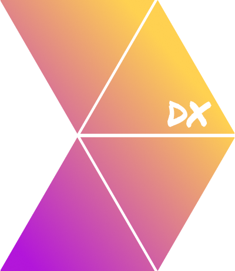

# DX-analytics-vite-plugin


[](https://github.com/fforres/vite-plugin-dx-metrics/actions?query=workflow%3Atest) [](https://www.npmjs.com/package/@fforres/vite-plugin-dx)

</img>


This vite plugin is written in typescript, and serves as a way to quickly gather meaningful information on a vite project's DX usage and sending it to datadog via [datadog-metrics](https://github.com/dbader/node-datadog-metrics).

Plugin keeps track of execution of different [vite hooks](https://vitejs.dev/guide/api-plugin.html#universal-hooks/), and using some timers, calculates and reports on things like compilation or recompilation time.

## So... What can I do with it?

Adding it to your vite's config, it will track every module compilation and recompilation times, so you can see how your project's developer experience is performing in your teammate's machines.

For example, this is a screenshot a datadog dashboard created with this plugin.


## Install

If your are using yarn

```bash
yarn add --dev @fforres/vite-plugin-dx
```

or if you use npm

```bash
npm install --save-dev @fforres/vite-plugin-dx
```

## Usage

you can see some usage of it in the [./vite.config.ts](./vite.config.ts) file.
But in essence you require the `@fforres/vite-plugin-dx` and wrap your vite plugins in your `vite.config` file. At a bare minimum you need to pass you datadog api key, you can get it from **https://<YOUR_ORG>.datadoghq.com/account/settings#api**

```TYPESCRIPT
/* eslint-disable import/no-extraneous-dependencies */
import { defineConfig } from 'vite';
import DXVitePlugin from './build/src/index.js';

const { dxMetricsWrapper } = new DXVitePlugin({
  projectName: 'some-name',
  dryRun: true,
  datadogConfig: {
    apiKey: 'some-key',
    /* SOME DATADOG API KEY FROM https://<YOUR_ORG>.datadoghq.com/account/settings#api */
  },
});

// https://vitejs.dev/config/
export default defineConfig({
  plugins: dxMetricsWrapper([aPlugin, anotherPlugin]),
});

```

## Plugin Options

Options are defined by [`DXVitePluginProps`](./src/types.ts)

| Object Key         | Required | Default Value                                                   | Description                                                                                                                                                                                                                                                   |
| ------------------ | :------: | --------------------------------------------------------------- | ------------------------------------------------------------------------------------------------------------------------------------------------------------------------------------------------------------------------------------------------------------- |
| projectName        |   yes    |                                                                 | Datadog's project name, will be added to each track call as `projectName` tag                                                                                                                                                                                 |
| datadogConfig      |    no    | `{"prefix":"ux.vite.","flushIntervalSeconds":2}`             | Config object for [Datadog Metrics](https://github.com/dbader/node-datadog-metrics#readme) - Typescript Type [here](https://github.com/DefinitelyTyped/DefinitelyTyped/blob/6970a8fffa0743f0f5fc918e187fa37f0d2675df/types/datadog-metrics/index.d.ts#L6-L36) |
| enabledKeysToTrack |    no    | `['recompile','recompile_session','compile','compile_session']` | An array of keys that will define what "keys" will be tracked. By Default we track all the keys                                                                                                                                                               |
| tags               |    no    | `{}`                                                            | Extra tags to be added to [Datadog Metrics](https://github.com/dbader/node-datadog-metrics#readme) - An object shape of `{ tagName: "tagValue", environment: "production" }`                                                                                  |
| dryRun             |    no    | `false`                                                         | If `true`, will not send tracking events to datadog.                                                                                                                                                                                                          |

```TYPESCRIPT
{
  projectName: string;
  datadogConfig?: BufferedMetricsLoggerOptions;
  enabledKeysToTrack?: TrackingMetricKeys[];
  tags?: { [key: string]: string };
  dryRun?: boolean;
}
```

## Development

- `git clone`
- `yarn`
- `yarn dev` to run a super-simple vite-server with the plugin `debug` enabled
- or `yarn debug` to run vite with node `--inspect-brk` flag, and be able to debug using the [NIM - Node Inspector Manager](https://chrome.google.com/webstore/detail/nodejs-v8-inspector-manag/gnhhdgbaldcilmgcpfddgdbkhjohddkj?hl=en) chrome extension
- Once you have this running, go ahead and change (and save) a file inside [./app/](./app)

## Deploy

To deploy, create a PR and bump the the version in `package.json`. Once the PR
is merged it will deploy a new version of the package.

## Current things being tracked

| Metric               | Tracking key        | Description                                                                                                                                                                   | How are we tracking   |
| -------------------- | ------------------- | ----------------------------------------------------------------------------------------------------------------------------------------------------------------------------- | --------------------- |
| compilationSession   | `compile_session`   | Tracks the time from when a "compilation" process starts, until it finishes. | histogram & increment |
| recompilationSession | `recompile_session` | Tracks the time when module recompilation starts, until it finishes.  | histogram & increment |

## Things we might want to track but no decision yet

- **System info** [🔗](https://github.com/sebhildebrandt/systeminformation)
  > Creepy factor. 😬 However maybe useful on companies/internally. Being able
  > to debug, or on bigger companies it would be useful to figurwe out hat type
  > of devices are slower/faster.
- **git commit sha.**
  > Creepy factor. 🤔
- **branch**
  > Creepy factor. 🤔
